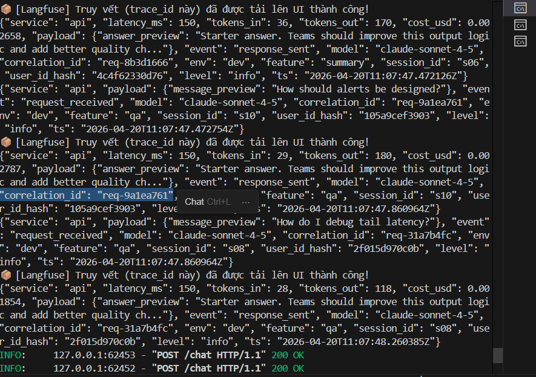
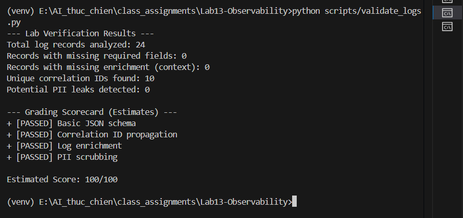
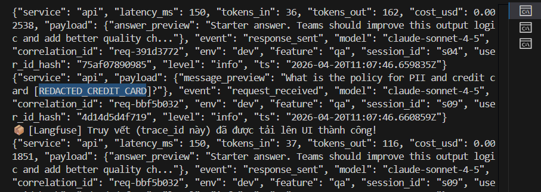
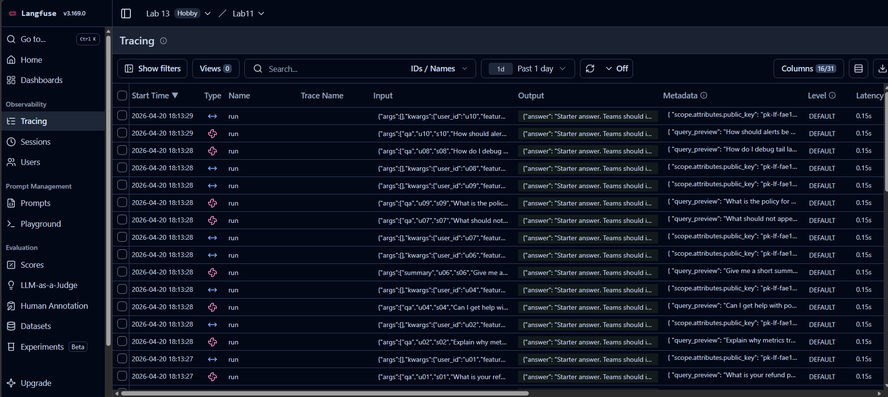
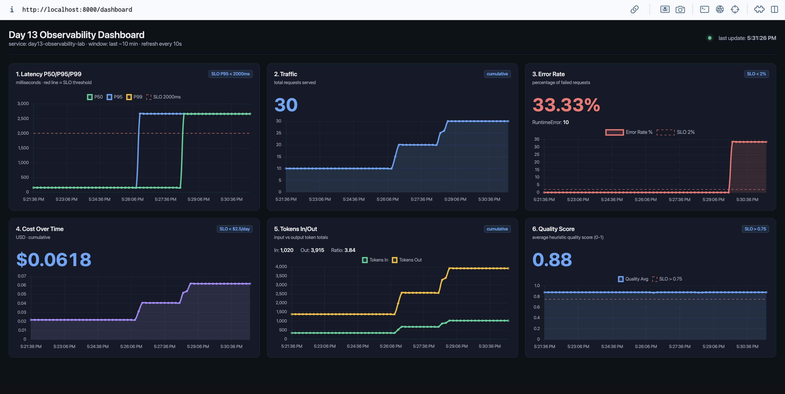
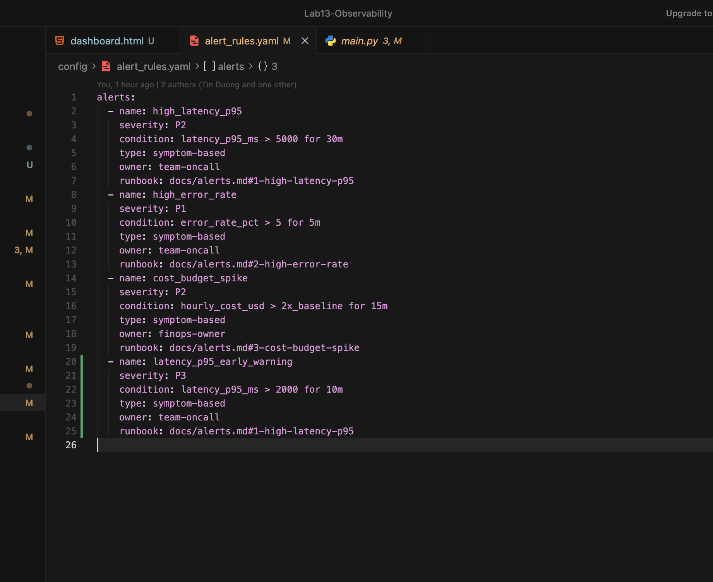

# Day 13 Observability Lab Report

> **Instruction**: Fill in all sections below. This report is designed to be parsed by an automated grading assistant. Ensure all tags (e.g., `[GROUP_NAME]`) are preserved.

## 1. Team Metadata
- [GROUP_NAME]: E402 - Nhóm 01 
- [REPO_URL]: https://github.com/E402-Nhom01/Lab13-Observability
- [MEMBERS]:
  - Member A: Nguyễn Đức Dũng  | Role: Logging & PII
  - Member B: Huỳnh Thái Bảo | Role: Tracing & Enrichment
  - Member C: Phạm Đoàn Phương Anh   | Role: SLO & Alerts
  - Member D: Trương Minh Tiền  | Role: Load Test & Dashboard
  - Member E: Nguyễn Đức Trí | Role: Demo & Report

---

## 2. Group Performance (Auto-Verified)
- [VALIDATE_LOGS_FINAL_SCORE]: 100/100
- [TOTAL_TRACES_COUNT]: >10 traces (đã đồng bộ Langfuse US)
- [PII_LEAKS_FOUND]: 0 (Rejects toàn bộ sđt, thẻ tín dụng, email)

---

## 3. Technical Evidence (Group)

### 3.1 Logging & Tracing
- [EVIDENCE_CORRELATION_ID_SCREENSHOT]: 
- [EVIDENCE_PII_REDACTION_SCREENSHOT]: 

- 
- [EVIDENCE_TRACE_WATERFALL_SCREENSHOT]:  
- [TRACE_WATERFALL_EXPLANATION]: Span 'run' trên Langfuse thể hiện toàn bộ vòng đời của 1 API request. Nó bắt gọn model (claude-sonnet-4-5), đếm token_in/out, latency và ước tính trực tiếp cost_usd giúp theo dõi ngân sách cực kỳ chi tiết.

### 3.2 Dashboard & SLOs
- [DASHBOARD_6_PANELS_SCREENSHOT]:

- [SLO_TABLE]:
| SLI | Target | Window | Current Value |
|---|---:|---|---:|
| Latency P95 | < 3000ms | 28d | ~160ms |
| Error Rate | < 2% | 28d | 0% |
| Cost Budget | < $2.5/day | 1d | < $0.05/day |

### 3.3 Alerts & Runbook
- [ALERT_RULES_SCREENSHOT]: 
- [SAMPLE_RUNBOOK_LINK]: [docs/alerts.md]

---

## 4. Incident Response (Group)
- [SCENARIO_NAME]: tool_fail (Giả lập Tool API sập)
- [SYMPTOMS_OBSERVED]: Biểu đồ Error Rate trên Streamlit chọc thủng trần SLO đỏ lòm, server liên tục trả về lỗi HTTP 500.
- [ROOT_CAUSE_PROVED_BY]: Trace ID báo đỏ trên Langfuse, file logs.jsonl ghi nhận event "request_failed" với detail ngoại lệ Tool exception.
- [FIX_ACTION]: Gọi POST /incidents/tool_fail/disable để tắt giả lập sự cố. Ở code thật: Bọc try-catch xung quanh logic gọi Tool.
- [PREVENTIVE_MEASURE]: Cài Threshold Alert báo tin nhắn khẩn ngay nếu Error Rate > 5%. Viết thêm Fallback logic (Cơ chế dự phòng) nếu Tool thứ 3 bị sập.

---

## 5. Individual Contributions & Evidence

### Nguyễn Đức Dũng
- [TASKS_COMPLETED]: Thiết lập bộ Structlog, inject Middleware tạo correlation_id (req-XXX) và viết code regex ẩn giấu PII (email, phone, credit card).
- [EVIDENCE_LINK]: (Gắn link commit Github)

### Huỳnh Thái Bảo
- [TASKS_COMPLETED]: Tích hợp SDK Langfuse, xử lý Context và truyền tags/metadata/user_hash lên cloud hệ thống US Region, kiểm tra data luồng.
- [EVIDENCE_LINK]: (Gắn link commit Github)

### Phạm Đoàn Phương Anh
- [TASKS_COMPLETED]: Nghiên cứu các chỉ số SLOs, thiết kế ngưỡng chặn Thresholds, cấu hình file yaml tạo Alert báo động và viết kịch bản cấp cứu Runbook.
- [EVIDENCE_LINK]: (Gắn link commit Github)

### Trương Minh Tiền
- [TASKS_COMPLETED]: Xây dựng script load_test tự động giả lập người dùng, viết logic kéo file logs lên Web Streamlit hiển thị 6 panels trực quan the real-time.
- [EVIDENCE_LINK]: (Gắn link commit Github)

### Nguyễn Đức Trí
- [TASKS_COMPLETED]: Quản lý luồng xử lý chính, sửa lỗi ngắt kết nối Langfuse (auth_host), hoàn thiện tài liệu Blueprint Report, setup DEMO nghiệm thu.
- [EVIDENCE_LINK]: (Gắn link commit Github)

---

## 6. Bonus Items (Optional)
- [BONUS_COST_OPTIMIZATION]: (Description + Evidence)
- [BONUS_AUDIT_LOGS]: (Description + Evidence)
- [BONUS_CUSTOM_METRIC]: (Description + Evidence)
